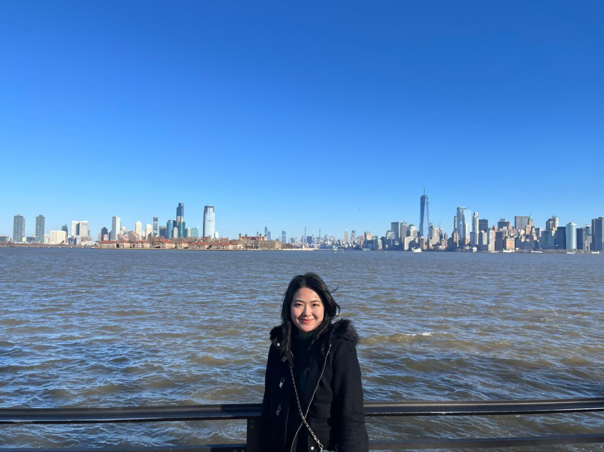

# Momoka Sakamoto
Hello! Welcome to my personal webpage.

## About Me
I'm a sophomore undergraduate student majoring in Electrical Computer Engineering. I'm groun up in Fukuoka, Japan, and have been there for 18 years. I came to Seattle two years ago to study at UW. 

I'm interested in nanoscience and nanotechnology. I want to engage in implementation of nanotechnology, materials in the future.

## Academic Experience
**Current Experience**

- This quarter, I'm taking EE 215, EE 241, EE 201, CSE 123, NME 220. I like NME 220 so far, which is nanoscience class containing varaiety of topics and theories related to nanotechnology.

- I started research in Professor Serena Eley's lab and study superconductor properties. I'm just getting started training, but I look forward to being deeply involved in the research.

**Past Experience**

- In high school, I researched semiconductor, thermoelectric materials with a curiosity for technology and materials for efficient energy.

- I mentored a kid at free school for his research project and interested in education for gifted children. 

- I joined some internships to get to know technology-based startups and also look for other oppurtunities to engage in social implementation of technology.

## Hobbies
**- I like traveling a lot** 

The cities I visited are New York, LA, Portland, Vancouver, Busan, Tokyo, Osaka, Kyoto, Hiroshima, Nagasaki, Okinawa.  In this summer, I'll go to Berlin for studying abroad and travel in Europe. I want to visit London, Rome, Paris, and explore around Europe.

**- I like listening to music**

I listen to pop, K-pop, J-pop a lot. The first track of my spring playlist is "Wasurerarenaino" by sakanaction.  I'm a big fan of NCT, which is a K-pop group with 26 members. 
My heavy rotation is "Space" by NCT 127. My bias is Winwin.

**- I also love watching movies**

I recently watched "Past Lives", and really loved it.

I also like outdoor activities. I go swimming whenever I have time. 